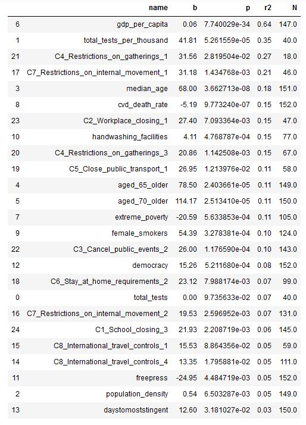
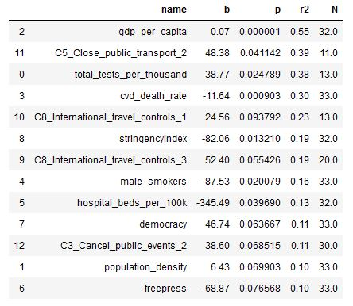

```{r setup, include=FALSE}
knitr::opts_chunk$set(echo = TRUE)
library(tidyverse) # includes dplyr, tidyr and ggplot2
library(jtools)
library(MASS)
library(sjPlot)

panel.cor <- function(x, y, digits = 2, prefix = "", cex.cor, ...)
{
    usr <- par("usr"); on.exit(par(usr))
    par(usr = c(0, 1, 0, 1))
    r <- cor(x, y, use= "complete.obs")
    txt <- format(c(r, 0.123456789), digits = digits)[1]
    txt <- paste0(prefix, txt)
    if(missing(cex.cor)) cex.cor <- 0.8/strwidth(txt)
    text(0.5, 0.5, txt)
}

vars<-c('total_tests',  'total_tests_per_thousand',
       'population_density', 'median_age', 'aged_65_older',
       'aged_70_older', 'gdp_per_capita', 'extreme_poverty',
       'cvd_death_rate', 'diabetes_prevalence', 'female_smokers',
       'male_smokers', 'handwashing_facilities', 'hospital_beds_per_100k',
       'freepress', 'democracy',
       'stringencyindex', 'daystomoststingent',
       'C8_International_travel_controls_4',
       'C8_International_travel_controls_3',
       'C8_International_travel_controls_2',
       'C8_International_travel_controls_1',
       'C7_Restrictions_on_internal_movement_2',
       'C7_Restrictions_on_internal_movement_1',
       'C6_Stay_at_home_requirements_3', 'C6_Stay_at_home_requirements_2',
       'C6_Stay_at_home_requirements_1', 'C5_Close_public_transport_2',
       'C5_Close_public_transport_1', 'C4_Restrictions_on_gatherings_4',
       'C4_Restrictions_on_gatherings_3',
       'C4_Restrictions_on_gatherings_2',
       'C4_Restrictions_on_gatherings_1', 'C3_Cancel_public_events_2',
       'C3_Cancel_public_events_1', 'C2_Workplace_closing_3',
       'C2_Workplace_closing_2', 'C2_Workplace_closing_1',
       'C1_School_closing_3', 'C1_School_closing_2',
       'C1_School_closing_1')

# data created by ipython notbeook. that code needs to be run to upadte the dataset with the latest case counts!
anal<-read.csv('data/20200515_complete.csv')
anal<-anal%>%dplyr::mutate_if( is.numeric, as.numeric)


```
# Introduction

The main question of this exercise is to how different country level characteristics impact the per capita case count.
Data was prepared by a separate ipython notebook (gov_action_data_prepapartion.ipynb), from the following sources:
* Oxford Coronavirus Government Response Tracker (OxCGRT)
* freedom house democracy report (higher numbers mean stronger democracies)
* reporters without frontiers press freedom report (lower numbers mean stronger press freedoms)
* latest case and death per capita, and GDP/capita from "our world in data"

The OxCGRT data is coded as follows: for various lock down measures and levels we calculated the time (in days) between the first recorded covid case, and the date of government action. Higher numbers mean longer government inaction. 

# Correlation matrix

```{r correlation, echo=FALSE, out.width="200%", fig.width = 10 }


correlations <- anal %>%
  dplyr::select (total_cases_per_million, 
                 median_age, 
                 aged_65_older,
                 aged_70_older,
                 gdp_per_capita,
                 freepress,
                 democracy,
                 stringencyindex,
                 daystomoststingent,
                 C1_School_closing_3,
                 C2_Workplace_closing_3,
                 C3_Cancel_public_events_2,
                 C4_Restrictions_on_gatherings_3,
                 C4_Restrictions_on_gatherings_4,
                 C6_Stay_at_home_requirements_3,
                 C7_Restrictions_on_internal_movement_2,
                 C8_International_travel_controls_3,
                 C8_International_travel_controls_4) %>%
      dplyr::mutate_if( is.numeric, as.numeric)%>%
  as.matrix() %>%
  pairs(lower.panel = panel.smooth,
        upper.panel = panel.cor,
      gap=0, 
      row1attop=FALSE, 
      main="Correlation coefficients on the upper panels, scatter plots in the lower panels with LOESS smooths")

```

# Simple OLS models

In the first step, we run simple OLS regressions with the total case per million as dependent variable, and a single independent var.
The table here was generated in python, and saved as a plot. It is clear that though speedy government action matters, lock down-related variables are not the most important in explaining the variance. Wealth is the most relevant, testing, median age, democracy index are all very good explanatory variables.

``` {r ols global plot, echo=FALSE}

```

# Regression models

Instead of the correlation, here we use a Negative Binomial model, which fits better our count data, and use the democracy variable, and some of the lock down speed variables. 
The democracy variable is from Freedom House, and measures the quality of democratic institutions in a country.
Lock down variables measure how many days did it take for a country to implement various lock down measures after the first registered case.


```{r regressions, echo=FALSE}
m1 <- glm.nb (total_cases_per_million ~ 
                          C4_Restrictions_on_gatherings_3 +
                          democracy                           ,
                        data = anal)

m2 <- glm.nb (total_cases_per_million ~ 
                          C4_Restrictions_on_gatherings_4 +
                          democracy                           ,
                        data = anal)

m3 <- glm.nb (total_cases_per_million ~ 
                          stringencyindex +
                          democracy                           ,
                        data = anal)

m4 <- glm.nb (total_cases_per_million ~ 
                          daystomoststingent +
                          democracy                           ,
                        data = anal)

m5 <- glm.nb (total_cases_per_million ~ 
                          C2_Workplace_closing_3 +
                          democracy                           ,
                        data = anal)

m6 <- glm.nb (total_cases_per_million ~ 
                          C1_School_closing_3 +
                          democracy                           ,
                        data = anal)
```

```{r simple model sums, echo=FALSE}
export_summs(m1,m2,m3,m4,m5,m6,
             digits=3, 
             statistics = "all")
```
In the global models, the democracy effect and the speed of lock downs are both significant. Speedier lock down lowers the number of per capita cases, while more democratic countries tend to have more cases.


```{r best global model}
plot(m1)
plot_model(m1,type = "pred")
```
## interaction model

In the interaction model we look at how the effect of the speedy lock down changes in countries with different levels of democracy. All values are significant. The negative sign of the interaction term suggests that the effect of speedy action is lover in better democracies.

```{r interaction, echo=FALSE}
i1<-glm.nb (total_cases_per_million ~ 
                          C2_Workplace_closing_3 *
                          democracy                           ,
                        data = anal)

summary(i1)
```

```{r plot global interaction, echo=FALSE}
hist (anal$daystomoststingent)
plot_model(i1,type = "eff", terms=c('C2_Workplace_closing_3[-10:50]','democracy[25,70,100]'))
```
The interaction graph suggests that even if two  countries  immediately take  strict measures, the more democratic will start with a significant case penalty.


# European countries only

## OLS regressions

First, let's see the simple OLS regressions for European countries only
``` {r ols eu plot, echo=FALSE}

```

Let's run the same models for European countries only:
```{r eu countries, echo=FALSE}
anal1<-subset(anal, Region=="Europe")
anal1$country
```
```{r eu corr matrix, echo=FALSE}

correlations <- anal1 %>%
  dplyr::select (total_cases_per_million, 
                 median_age, 
                 freepress,
                 democracy,
                 gdp_per_capita,
                 stringencyindex,
                 daystomoststingent,
                 C1_School_closing_3,
                 C2_Workplace_closing_3,
                 C3_Cancel_public_events_2,
                 C4_Restrictions_on_gatherings_4,
                 C6_Stay_at_home_requirements_3) %>%
      dplyr::mutate_if( is.numeric, as.numeric)%>%
  as.matrix() %>%
  pairs(lower.panel = panel.smooth,
        upper.panel = panel.cor,
      gap=0, 
      row1attop=FALSE, 
      main="Correlation coefficients on the upper panels, scatter plots in the lower panels with LOESS smooths")

```

```{r eu regressions, echo=FALSE}
m1eu <- glm.nb (total_cases_per_million ~ 
                          C4_Restrictions_on_gatherings_3 +
                          democracy                           ,
                        data = anal1)

m2eu <- glm.nb (total_cases_per_million ~ 
                          C4_Restrictions_on_gatherings_4 +
                          democracy                           ,
                        data = anal1)

m3eu <- glm.nb (total_cases_per_million ~ 
                          stringencyindex +
                          democracy                           ,
                        data = anal1)

m4eu <- glm.nb (total_cases_per_million ~ 
                          daystomoststingent +
                          democracy                           ,
                        data = anal1)

m5eu <- glm.nb (total_cases_per_million ~ 
                          C2_Workplace_closing_3 +
                          democracy                           ,
                        data = anal1)

m6eu <- glm.nb (total_cases_per_million ~ 
                          C1_School_closing_3 +
                          democracy                           ,
                        data = anal1)

m7eu <- glm.nb (total_cases_per_million ~ 
                          gdp_per_capita +
                          democracy                           ,
                        data = anal1)

export_summs(m1eu,m2eu,m3eu,m4eu,m5eu,m6eu,m7eu,
             digits=3, 
             statistics = "all")
```
Within Europe, the democracy variable is the most consistently significant variable, with a positive sign: stronger democracies tend to have higher per capita cases. Interestingly, we could not find any  significant effect of the speed of government actions. On the other hand wealth has the strongest effect: richer countries have more cases. Wealth and democracy index is strongly correlated.
This suggests that in Europe the worst case counts are characteristic of rich countries. Wealth is a proxy for a number of potential factors, which may all positively effect case count:

* higher internal and international mobility
* higher active elderly population
* more elderly living in care homes
* more guest workers, and seasonal workers
* slower institutional decision making, and more lax enforcement


```{r eu plot, echo=FALSE}

plot_model(m6eu,type = "pred")
```


There are no interactions.
```{r eu interaction, echo=FALSE}
i1eu<-glm.nb (total_cases_per_million ~ 
                          C2_Workplace_closing_3 *
                          democracy                           ,
                        data = anal1)

summary(i1eu)
```

```{r plot eu interaction, echo=FALSE}
hist (anal$daystomoststingent)
plot_model(i1eu,type = "eff", terms=c('C2_Workplace_closing_3[-10:50]','democracy[25,70,100]'))
```
